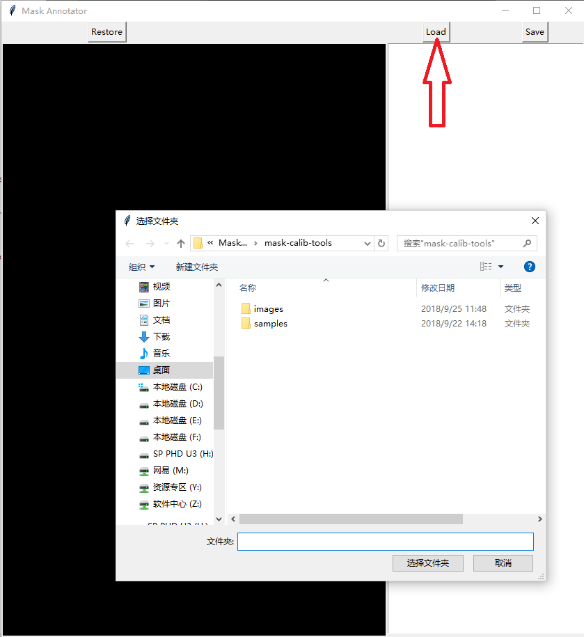
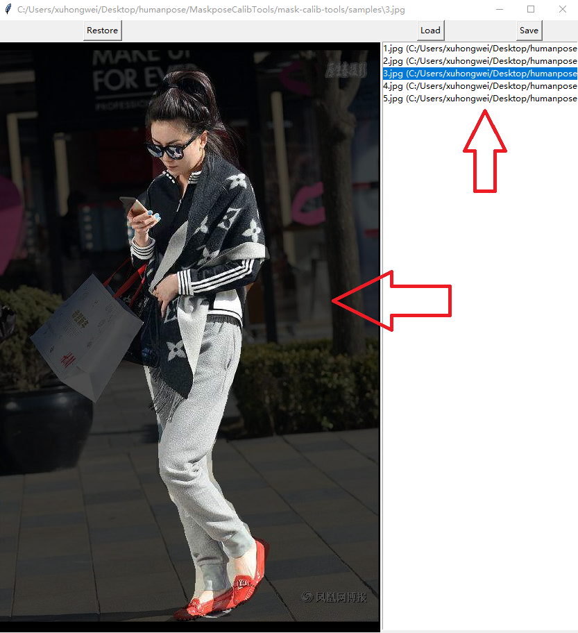
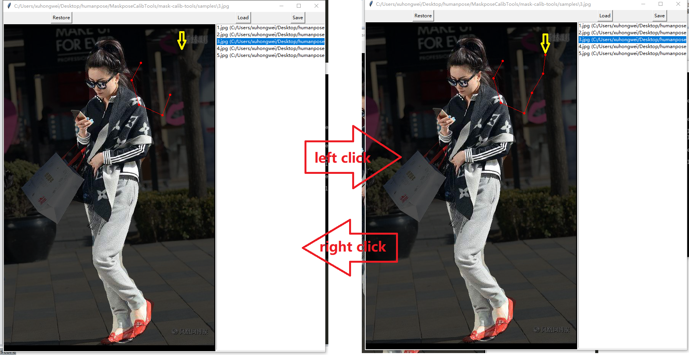
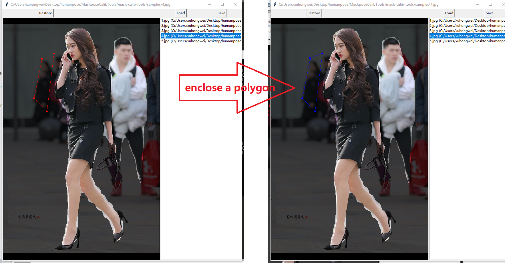
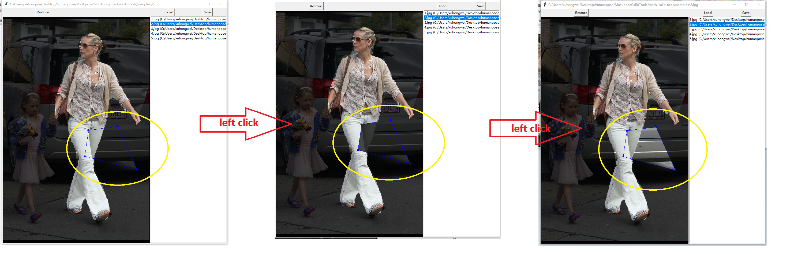
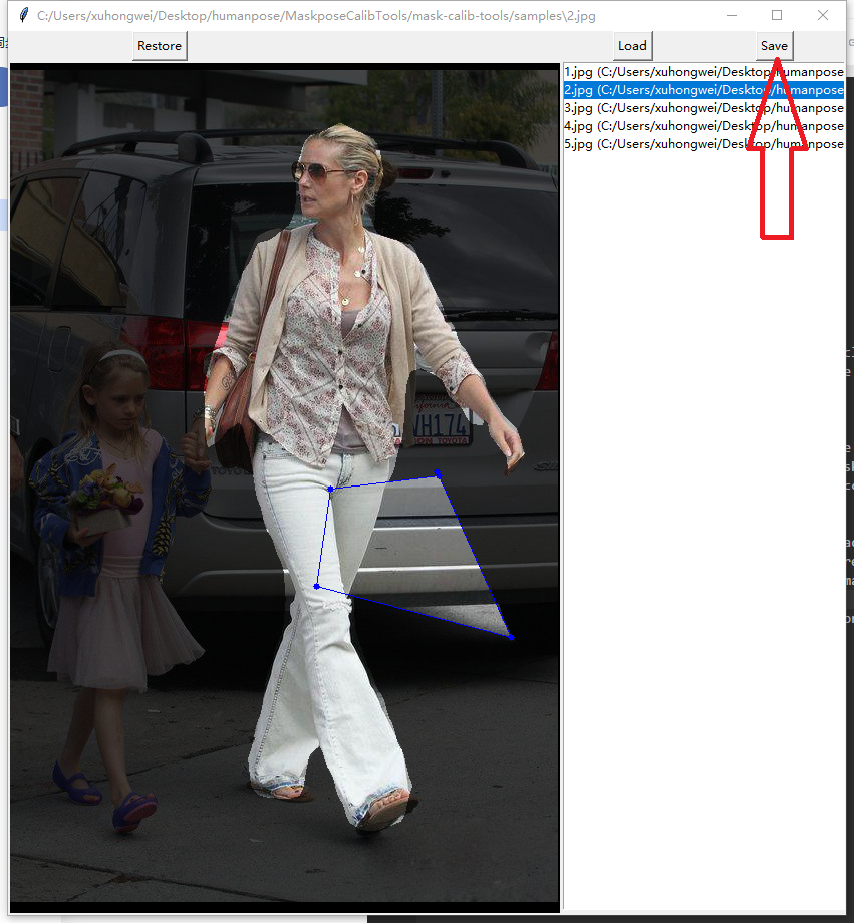
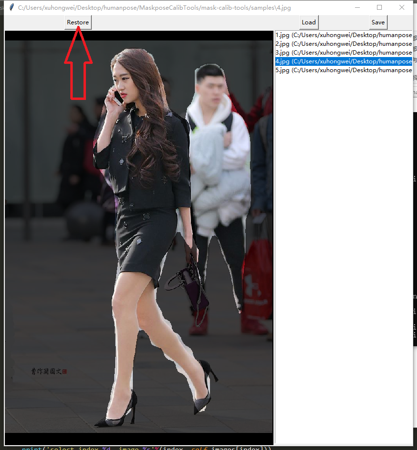

# Introductin
This project is a simple tool to modify mask annotations. This project has little requirements but simple and powerful to use with only some clicks.

# Dataset Format
The requirements for the format of the dataset is simple as follows:
1. The images and the masks are stored under the same directory as images.
2. For an image "name.jpg", the mask is "name_mask.jpg".
3. The images only support extensions".jpg", ".jpeg", and ".png". The mask only supports ".jpg" extension.

# Requirements
1. Python3
2. Pillow
3. numpy
4. OpenCV2
5. matplotlib

```
pip install Pillow numpy opencv-python matplotlib
```

# Getting Started
- Load a directory of images and masks.



- Click on the list to switch between images



- Left-click on the image to enclose a polygon. Right-click on the image to undo last left-click. When a polygon is encolsed, the colr will change from red to blue.




- When the polygon is enclosed, left-clicking the image will switch the mask inside the polygon in three modes: (1) original mask (2) all 0s (3) all 1s; right-clicking the image will change the mask according the mode chosen.



- Switching into another image will automatically replace the original mask by the modified mask. To save the mask manually, press "Save" button. (If the mask is modified and not saved, a "* " will be marked on the title bar)



- Press "Restore" button will restore the mask to the original one.


